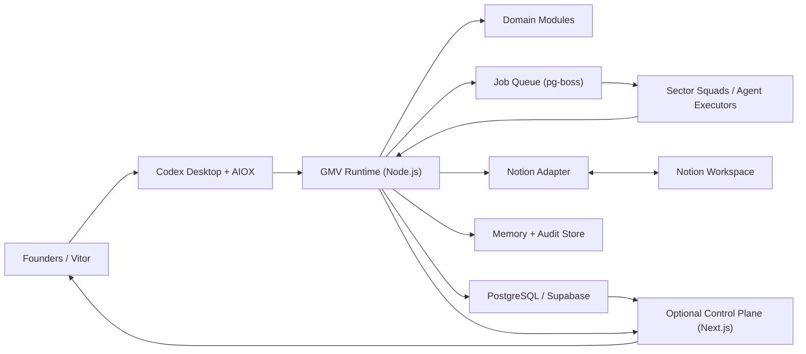
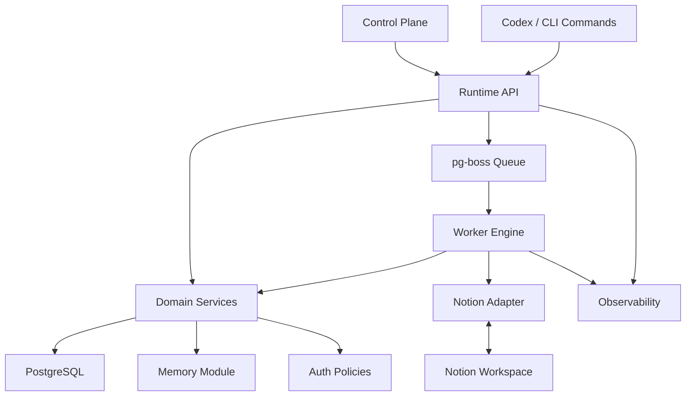
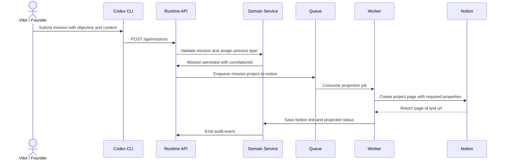
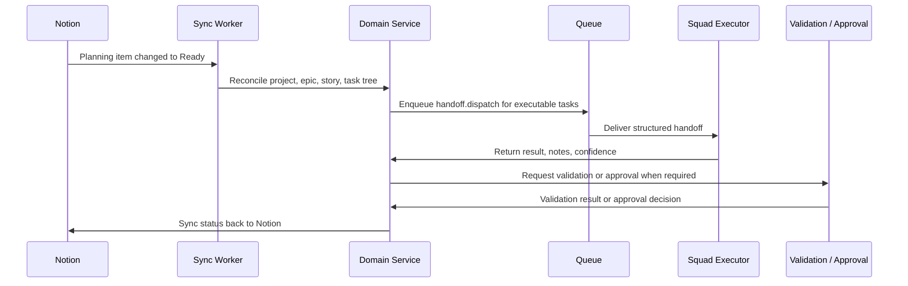
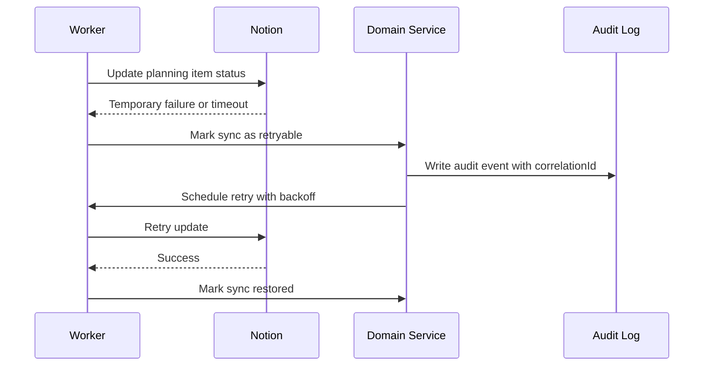

# GMV AI Company Fullstack Architecture Document

## Introduction

This document defines the implementation architecture for GMV AI Company as an agent-first operating system built on top of `aiox-core` and used from Codex Desktop. It covers the runtime layer that receives missions, converts them into executable work, synchronizes planning state with Notion, and gives founders and operators enough observability to run the business without hidden context.

This architecture follows the project constitution:

- `CLI First -> Observability Second -> UI Third`
- architecture decisions must stay traceable to [docs/prd.md](./prd.md)
- the MVP must stay simple enough for a one-person company with agent support

### Starter Template or Existing Project

N/A - Greenfield project.

The current repository already contains the AIOX/Codex scaffolding and product documentation, but there is no existing application runtime to preserve. The implementation should be bootstrapped manually as a `pnpm` workspace monorepo so the architecture stays aligned to the PRD instead of inheriting accidental constraints from a starter.

### Change Log

| Date | Version | Description | Author |
|------|---------|-------------|--------|
| 2026-03-08 | 0.1 | Initial architecture draft based on the refined PRD and source documents in `.docs` | Codex |

## High Level Architecture

### Technical Summary

GMV AI Company should be implemented as a modular monolith with an agent-first runtime at its core, a Notion synchronization layer for planning artifacts, and an optional web control plane for observability and approvals. The runtime is responsible for mission intake, handoffs, approvals, validations, queue execution, memory, audit history, and reconciliation with Notion. Notion is the source of truth for planning and delivery management objects such as projects, epics, stories, and tasks, while PostgreSQL is the source of truth for runtime state, execution history, and operational telemetry. The primary operator surface remains Codex Desktop and AIOX artifacts; any web surface exists to observe, approve, and inspect, never to replace the CLI runtime. This architecture directly supports the PRD goals of structured agent coordination, Notion-centered planning, and scalable execution across Marketing, Sales, and Technology.

### Platform and Infrastructure Choice

Three viable deployment options were considered for the MVP:

1. `Vercel + Supabase`: excellent for the optional web layer, but weak for long-running worker processes and queue-heavy orchestration.
2. `AWS full stack`: very flexible, but too operationally heavy for the current one-person MVP.
3. `Railway + Supabase + Notion`: supports always-on Node.js workers, keeps managed data services simple, and leaves the web layer optional.

Recommended choice for MVP:

- **Application runtime:** Railway
- **Core data/auth/storage:** Supabase
- **Planning system:** Notion
- **Optional web deployment:** Vercel only when the control plane is enabled
- **Primary operator entry point:** Codex Desktop + `aiox-core`

Rationale:

- the runtime needs durable background work, retries, and queue consumers;
- the product is CLI-first, so the system should not depend on serverless HTTP lifecycles;
- Supabase gives PostgreSQL, Auth, and Storage without forcing premature infrastructure complexity;
- Notion remains external and canonical for planning without becoming the runtime database.

### Repository Structure

**Structure:** Monorepo

**Monorepo Tool:** `pnpm` workspaces + `turbo`

**Package Organization:**

```text
apps/
  runtime/                # Fastify API + command handlers + background worker entrypoints
  control-plane/          # Optional Next.js dashboards and approval UI
packages/
  domain/                 # Core business rules, entities, services
  contracts/              # Zod schemas and typed payloads
  notion-adapter/         # Notion client, mappers, sync and reconciliation logic
  queue/                  # pg-boss job definitions and dispatch helpers
  memory/                 # Memory records, retrieval, artifact links
  auth/                   # Role and permission policies
  observability/          # Logging, tracing, metrics, correlation ids
  config/                 # Shared environment parsing and app config
bin/
  gmv.ts                  # CLI entrypoint for local operational commands
docs/
  prd.md
  architecture.md
```

### Core Source-of-Truth Model

The architecture depends on a clear split of authority between systems:

- **Codex Desktop + AIOX:** primary control surface for operators and agent workflows.
- **Notion:** source of truth for planning and coordination objects:
  - projects
  - epics
  - stories
  - tasks
  - owners
  - readiness
  - planning status
- **PostgreSQL:** source of truth for runtime and audit objects:
  - missions
  - handoffs
  - approvals
  - validation outcomes
  - workflow runs
  - retry state
  - sync cursors
  - memory artifacts
  - audit events
- **Optional control plane:** read-mostly projection and approval surface backed by the runtime API.

This split is intentional. If Notion is asked to behave as both planner and runtime event store, the system will become fragile. If PostgreSQL tries to replace Notion planning for the MVP, the user loses the workflow they explicitly asked for. The design therefore treats Notion as canonical for work planning and PostgreSQL as canonical for operational execution.

### High Level Architecture Diagram



### Architectural Patterns

- **Modular Monolith:** chosen over microservices for MVP simplicity, shared business rules, and lower deployment overhead.
- **Ports and Adapters:** chosen so Notion, Supabase, and future CRM/ad channels remain replaceable integration boundaries.
- **Schema-First Contracts:** chosen so missions, planning items, handoffs, and approvals are validated with explicit payload schemas before routing.
- **Postgres-Backed Asynchronous Work Queue:** chosen over Redis-first queues so the MVP keeps operational state and job durability in one managed platform.
- **Command + Projection Model:** chosen instead of full CQRS. Commands mutate runtime state; projections power dashboards, timelines, and executive views.
- **Reconciliation-Based External Sync:** chosen over a webhook-dependent design so Notion synchronization stays deterministic and resilient even if external callbacks are delayed or unavailable.
- **UI as Observability Layer:** chosen to stay compliant with the constitution. The runtime must work without the web layer.

## Tech Stack

The versions below are the baseline implementation targets for the first build. Managed services are marked as managed because patch versions are controlled by the provider.

| Category | Technology | Version | Purpose | Rationale |
|----------|------------|---------|---------|-----------|
| Language | TypeScript | 5.9.3 | Primary implementation language | Strong contracts, consistent schemas, good DX across runtime and web |
| Runtime | Node.js | 24.13.1 | Runtime for API, workers, and CLI | Matches current environment and supports a single language stack |
| Package Manager | pnpm | 10.31.0 | Workspace and dependency management | Fast, workspace-friendly, deterministic installs |
| Monorepo Build | turbo | 2.8.14 | Task orchestration across apps/packages | Good fit for a workspace with runtime, UI, and shared packages |
| Web Framework | Next.js | 16.1.6 | Optional control plane and executive dashboards | Mature React fullstack framework with strong internal tooling |
| UI Library | React | 19.2.4 | UI rendering | Aligns with Next.js and supports modern server-first patterns |
| Styling | Tailwind CSS | 4.2.1 | Styling system for the control plane | Fast iteration for an internal product without heavy CSS ceremony |
| Query Layer | @tanstack/react-query | 5.90.21 | Live data fetching in the control plane | Useful for queue boards, approvals, and status refresh |
| API Framework | Fastify | 5.8.2 | Runtime HTTP API and health endpoints | Lightweight, fast, and simple for internal APIs |
| Validation | Zod | 4.3.6 | Schema validation for commands and integrations | Single source of truth for runtime payload validation |
| Database | PostgreSQL | 17, managed by Supabase | Runtime state, audit, sync metadata, memory metadata | Reliable relational model for missions, links, and history |
| ORM / SQL Toolkit | Drizzle ORM | 0.45.1 | Migrations and typed data access | Minimal abstraction with good TypeScript ergonomics |
| Queue | pg-boss | 12.14.0 | Durable job queue backed by PostgreSQL | Removes Redis from the MVP while keeping retries and scheduling |
| Notion SDK | @notionhq/client | 5.11.1 | Notion integration for planning entities | Official SDK for page, database, and search operations |
| Auth | Supabase Auth | managed | Human operator authentication | Good enough for founders, operators, and approvers in MVP |
| File Storage | Supabase Storage | managed | Attachment and artifact storage | Co-located with data/auth platform |
| Logging | Pino | 10.3.1 | Structured logs | Fast JSON logs with low ceremony |
| Error Monitoring | @sentry/node / @sentry/nextjs | 10.42.0 | Runtime and UI exception tracking | Practical monitoring baseline without custom setup |
| Tracing API | @opentelemetry/api | 1.9.0 | Trace correlation hooks | Keeps a path open for deeper observability later |
| Unit / Integration Testing | Vitest | 4.0.18 | Domain and module testing | Fast TypeScript-native test runner |
| E2E Testing | @playwright/test | 1.58.2 | Control-plane and critical workflow E2E tests | Useful once UI and approval surfaces exist |
| DX Runtime | tsx | 4.21.0 | Local TypeScript execution | Simple local command execution during development |
| Deployment | Railway | managed | Runtime API and worker deployment | Better fit than serverless for long-running background work |
| Optional Web Deployment | Vercel | managed | Control-plane deployment when enabled | Strong fit for the optional Next.js surface |
| CI/CD | GitHub Actions | managed | Validation and deployment pipeline | Standard, repo-native, low-friction automation |

## System Context and Runtime Boundaries

### Actors

- **Founders:** define strategic direction and high-impact approvals.
- **Vitor Perin:** technical lead and primary human operator of the agent system.
- **OpenClaw:** artificial CEO and mission-to-project orchestrator.
- **C-level agents:** convert projects into epics, stories, and tasks in Notion.
- **Sector squads:** execute operational tasks inside domain workflows.
- **Brand and Quality layers:** validate narrative consistency and delivery quality.

### Runtime Boundaries

- **Inside the GMV runtime boundary**
  - mission intake
  - sector routing
  - handoff validation
  - queue execution
  - audit and history
  - approval workflows
  - memory records
  - Notion synchronization and reconciliation
- **Outside the runtime boundary**
  - Notion workspace editing itself
  - external ad platforms and CRMs
  - LLM provider orchestration already handled by AIOX/Codex
  - communication channels not yet selected in the PRD

## Data Models

### Mission

**Purpose:** top-level strategic intent handed from Vitor or founders to OpenClaw.

**Key Attributes:**

- `id`: `uuid` - internal mission identifier
- `title`: `string`
- `objective`: `string`
- `context`: `jsonb`
- `priority`: `enum(low, medium, high, critical)`
- `status`: `enum(draft, accepted, projected, in_execution, blocked, completed, archived)`
- `initiatorId`: `uuid`
- `ownerAgentId`: `uuid`
- `successCriteria`: `jsonb`
- `processType`: `enum(strategic, operational, optimization, governance)`
- `notionProjectPageId`: `string | null`
- `createdAt`: `timestamptz`
- `updatedAt`: `timestamptz`

```ts
export interface Mission {
  id: string;
  title: string;
  objective: string;
  context: Record<string, unknown>;
  priority: "low" | "medium" | "high" | "critical";
  status:
    | "draft"
    | "accepted"
    | "projected"
    | "in_execution"
    | "blocked"
    | "completed"
    | "archived";
  initiatorId: string;
  ownerAgentId: string;
  successCriteria: Array<{ label: string; metric?: string; target?: string }>;
  processType: "strategic" | "operational" | "optimization" | "governance";
  notionProjectPageId?: string;
}
```

**Relationships:**

- one mission projects to one Notion project page
- one mission owns many planning items
- one mission emits many handoffs and audit events

### Planning Item

**Purpose:** normalized projection of the Notion hierarchy into runtime-readable records.

**Key Attributes:**

- `id`: `uuid`
- `kind`: `enum(project, epic, story, task)`
- `title`: `string`
- `missionId`: `uuid`
- `parentId`: `uuid | null`
- `notionPageId`: `string`
- `sector`: `enum(marketing, sales, technology, brand, quality, operations, support)`
- `ownerAgentId`: `uuid | null`
- `planningStatus`: `enum(backlog, refining, ready, in_progress, waiting_validation, done, cancelled)`
- `processType`: `enum(strategic, operational, optimization, governance)`
- `dependsOnIds`: `uuid[]`
- `externalUrl`: `string`

```ts
export interface PlanningItem {
  id: string;
  missionId: string;
  parentId?: string | null;
  notionPageId: string;
  kind: "project" | "epic" | "story" | "task";
  title: string;
  sector:
    | "marketing"
    | "sales"
    | "technology"
    | "brand"
    | "quality"
    | "operations"
    | "support";
  planningStatus:
    | "backlog"
    | "refining"
    | "ready"
    | "in_progress"
    | "waiting_validation"
    | "done"
    | "cancelled";
  processType: "strategic" | "operational" | "optimization" | "governance";
  ownerAgentId?: string | null;
  dependsOnIds: string[];
  externalUrl: string;
}
```

**Relationships:**

- planning items form a tree: `project -> epic -> story -> task`
- each planning item belongs to one mission
- task items may emit workflow runs, handoffs, approvals, and validations

### Agent Profile

**Purpose:** canonical registry of founders, OpenClaw, C-levels, specialists, workers, and human approvers.

**Key Attributes:**

- `id`: `uuid`
- `name`: `string`
- `slug`: `string`
- `actorType`: `enum(founder, ceo, c_level, specialist, worker, human_operator, system)`
- `sector`: `enum(...)`
- `phase`: `enum(mvp, phase_2, phase_3)`
- `status`: `enum(active, paused, disabled)`
- `permissions`: `jsonb`

**Relationships:**

- referenced by missions, planning items, handoffs, approvals, and memory ownership

### Handoff

**Purpose:** structured transfer of work between agents and sectors using the contract defined in `.docs/gmv-agent-handoffs.md`.

**Key Attributes:**

- `id`: `uuid`
- `taskId`: `uuid`
- `originAgentId`: `uuid`
- `targetAgentId`: `uuid`
- `taskType`: `string`
- `priority`: `enum(low, medium, high, critical)`
- `context`: `jsonb`
- `input`: `jsonb`
- `expectedOutput`: `jsonb`
- `deadlineAt`: `timestamptz | null`
- `validationRules`: `jsonb`
- `status`: `enum(pending, accepted, running, completed, rejected, escalated, expired)`
- `result`: `jsonb | null`
- `confidence`: `numeric(3,2) | null`
- `needsValidation`: `boolean`

```ts
export interface Handoff {
  id: string;
  taskId: string;
  originAgentId: string;
  targetAgentId: string;
  taskType: string;
  priority: "low" | "medium" | "high" | "critical";
  context: Record<string, unknown>;
  input: Record<string, unknown>;
  expectedOutput: Record<string, unknown>;
  deadlineAt?: string | null;
  validationRules: Array<{ rule: string; required: boolean }>;
  status:
    | "pending"
    | "accepted"
    | "running"
    | "completed"
    | "rejected"
    | "escalated"
    | "expired";
  result?: Record<string, unknown> | null;
  confidence?: number | null;
  needsValidation: boolean;
}
```

**Relationships:**

- belongs to a task-level planning item
- may create approval and validation records
- always generates audit events

### Workflow Run

**Purpose:** execution record for a task or handoff through the runtime queue.

**Key Attributes:**

- `id`: `uuid`
- `planningItemId`: `uuid`
- `handoffId`: `uuid | null`
- `jobName`: `string`
- `attempt`: `integer`
- `status`: `enum(queued, running, succeeded, failed, compensating, cancelled)`
- `startedAt`: `timestamptz | null`
- `finishedAt`: `timestamptz | null`
- `errorSummary`: `text | null`
- `correlationId`: `string`

**Relationships:**

- created for queue work and retry flows
- connected to logs, traces, and audit events

### Approval Decision

**Purpose:** explicit human or high-authority approval for strategic, risky, or external-facing work.

**Key Attributes:**

- `id`: `uuid`
- `planningItemId`: `uuid`
- `requestedByAgentId`: `uuid`
- `approverAgentId`: `uuid`
- `approvalType`: `enum(strategy, publication, infrastructure, quality_gate, exception)`
- `status`: `enum(pending, approved, rejected, superseded)`
- `decisionNotes`: `text | null`
- `decidedAt`: `timestamptz | null`

### Validation Result

**Purpose:** track brand, quality, and policy validation outcomes before approval or closure.

**Key Attributes:**

- `id`: `uuid`
- `planningItemId`: `uuid`
- `validatorAgentId`: `uuid`
- `validationType`: `enum(brand, quality, contract, readiness, policy)`
- `status`: `enum(passed, failed, warning)`
- `findings`: `jsonb`
- `validatedAt`: `timestamptz`

### Memory Record

**Purpose:** modular organizational memory for brand, products, sales, technology, and operations.

**Key Attributes:**

- `id`: `uuid`
- `domain`: `enum(brand, offers, sales, technology, operations, quality)`
- `title`: `string`
- `summary`: `text`
- `bodyRef`: `string`
- `tags`: `text[]`
- `sourceType`: `enum(delivery, decision, playbook, postmortem, asset)`
- `linkedPlanningItemId`: `uuid | null`
- `linkedMissionId`: `uuid | null`

### Audit Event

**Purpose:** append-only record of mission changes, syncs, approvals, escalations, and failures.

**Key Attributes:**

- `id`: `uuid`
- `aggregateType`: `string`
- `aggregateId`: `uuid`
- `eventType`: `string`
- `actorId`: `uuid | null`
- `payload`: `jsonb`
- `correlationId`: `string`
- `createdAt`: `timestamptz`

## Components

### 1. Runtime API (`apps/runtime`)

**Responsibility:** expose internal HTTP endpoints, CLI command handlers, health checks, and operator commands.

**Key Interfaces:**

- `POST /api/missions`
- `POST /api/handoffs`
- `POST /api/approvals/:id/decision`
- `POST /api/sync/notion/reconcile`
- `GET /api/boards/executive`

**Dependencies:** `packages/domain`, `packages/contracts`, `packages/queue`, `packages/notion-adapter`, `packages/auth`, `packages/observability`

**Technology Stack:** Fastify + TypeScript + Zod + Pino

### 2. Worker Engine (`apps/runtime`, separate process mode)

**Responsibility:** consume jobs, execute mission projection, run reconciliations, perform retries, and advance workflow state.

**Key Interfaces:**

- `mission.project-to-notion`
- `planning.sync-from-notion`
- `handoff.dispatch`
- `approval.notify`
- `memory.capture`

**Dependencies:** `packages/queue`, `packages/domain`, `packages/notion-adapter`, `packages/memory`, `packages/observability`

**Technology Stack:** Node.js worker process + pg-boss

### 3. Domain Layer (`packages/domain`)

**Responsibility:** enforce business rules for missions, process types, approvals, escalations, and status transitions.

**Key Interfaces:**

- `MissionService`
- `PlanningService`
- `HandoffService`
- `ApprovalService`
- `ValidationService`

**Dependencies:** `packages/contracts`, persistence adapters, event publisher interfaces

**Technology Stack:** TypeScript domain services, pure business logic where possible

### 4. Contracts Package (`packages/contracts`)

**Responsibility:** define the payload schemas used across runtime, workers, and integrations.

**Key Interfaces:**

- `missionSchema`
- `planningItemSchema`
- `handoffSchema`
- `approvalDecisionSchema`
- `syncResultSchema`

**Dependencies:** none except shared validation libraries

**Technology Stack:** Zod

### 5. Notion Adapter (`packages/notion-adapter`)

**Responsibility:** map runtime commands and projections to Notion pages/databases and keep both sides reconciled.

**Key Interfaces:**

- `createProjectFromMission`
- `upsertPlanningTree`
- `syncPlanningStatus`
- `reconcilePlanningWindow`
- `resolveNotionIdentity`

**Dependencies:** official Notion SDK, contracts, observability, queue

**Technology Stack:** `@notionhq/client` + typed mappers

### 6. Queue Package (`packages/queue`)

**Responsibility:** centralize job names, retry policy, delayed jobs, and idempotency controls.

**Key Interfaces:**

- `publishJob`
- `consumeJob`
- `withIdempotencyKey`
- `scheduleReconciliation`

**Dependencies:** PostgreSQL connection, observability

**Technology Stack:** `pg-boss`

### 7. Memory Package (`packages/memory`)

**Responsibility:** store reusable operational memory with links back to source decisions and deliverables.

**Key Interfaces:**

- `captureDecision`
- `captureDelivery`
- `listByDomain`
- `searchMemory`

**Dependencies:** database adapter, storage adapter

**Technology Stack:** PostgreSQL metadata + Supabase Storage references

### 8. Control Plane (`apps/control-plane`)

**Responsibility:** show executive dashboards, approval queues, handoff boards, and mission timelines without becoming the primary control surface.

**Key Interfaces:**

- executive board
- mission detail page
- approvals queue
- handoff queue
- Notion-linked planning explorer

**Dependencies:** runtime API, auth, observability

**Technology Stack:** Next.js + React + Tailwind + React Query

### Component Diagram



## API Surface

The MVP does not need a public developer API. It needs a small internal API for the control plane, automation hooks, and local operator tooling.

### Internal Endpoint Groups

| Method | Path | Purpose | Auth |
|--------|------|---------|------|
| `POST` | `/api/missions` | Create a mission and queue projection to Notion | founder, operator |
| `GET` | `/api/missions/:missionId` | Read mission detail and execution timeline | authenticated |
| `POST` | `/api/planning-items/:id/refresh` | Force reconciliation for one Notion-linked planning item | operator |
| `POST` | `/api/handoffs` | Create and validate a structured handoff | authenticated service or operator |
| `POST` | `/api/handoffs/:id/respond` | Register handoff result, confidence, notes, validation need | authenticated service or operator |
| `POST` | `/api/approvals/:id/decision` | Approve or reject a pending decision | founder, CEO surrogate, quality approver |
| `GET` | `/api/boards/executive` | Consolidated overview for sectors, bottlenecks, approvals, KPIs | authenticated |
| `GET` | `/api/boards/handoffs` | Read the live handoff queue | authenticated |
| `POST` | `/api/sync/notion/reconcile` | Trigger reconciliation worker | operator |
| `GET` | `/health` | Liveness/readiness for infrastructure | unauthenticated internal use |

### API Design Rules

- internal JSON REST only for MVP
- every write route validates input with shared Zod schemas
- every mutation creates an audit event
- every asynchronous mutation returns a `correlationId`
- all endpoints use idempotency keys where repeat submission is likely

## External APIs

### Notion API

- **Purpose:** create and update projects, epics, stories, and tasks in the canonical planning workspace
- **Documentation:** https://developers.notion.com/reference/intro
- **Base URL:** `https://api.notion.com/v1`
- **Authentication:** internal integration token stored in server-only secrets
- **Primary operations used in MVP:**
  - create pages for project/epic/story/task records
  - update page properties for status, owner, priority, sector, and readiness
  - query databases to build local planning projections
  - search or retrieve pages to reconcile identity mappings

### Future Adapter Slots

The following integration classes are expected later but should remain out of MVP scope until requirements are explicit:

- CRM or pipeline tools
- ad platform APIs
- WhatsApp or messaging providers
- calendar/scheduling providers
- BI connectors

## Core Workflows

### Workflow 1: Mission Intake to Notion Project



### Workflow 2: C-Level Planning to Squad Execution



### Workflow 3: Reconciliation After Failure



## Database Schema

The schema below is the runtime schema. Notion remains external and canonical for planning objects, but the runtime keeps a normalized projection so workflows can be validated and executed safely.

```sql
create type process_type as enum ('strategic', 'operational', 'optimization', 'governance');
create type mission_status as enum ('draft', 'accepted', 'projected', 'in_execution', 'blocked', 'completed', 'archived');
create type planning_kind as enum ('project', 'epic', 'story', 'task');
create type planning_status as enum ('backlog', 'refining', 'ready', 'in_progress', 'waiting_validation', 'done', 'cancelled');
create type handoff_status as enum ('pending', 'accepted', 'running', 'completed', 'rejected', 'escalated', 'expired');
create type approval_status as enum ('pending', 'approved', 'rejected', 'superseded');
create type validation_status as enum ('passed', 'failed', 'warning');
create type workflow_status as enum ('queued', 'running', 'succeeded', 'failed', 'compensating', 'cancelled');

create table agent_profiles (
  id uuid primary key,
  name text not null,
  slug text not null unique,
  actor_type text not null,
  sector text not null,
  phase text not null,
  status text not null,
  permissions jsonb not null default '{}'::jsonb,
  created_at timestamptz not null default now()
);

create table missions (
  id uuid primary key,
  title text not null,
  objective text not null,
  context jsonb not null default '{}'::jsonb,
  priority text not null,
  status mission_status not null,
  process_type process_type not null,
  initiator_id uuid not null references agent_profiles(id),
  owner_agent_id uuid not null references agent_profiles(id),
  notion_project_page_id text,
  success_criteria jsonb not null default '[]'::jsonb,
  created_at timestamptz not null default now(),
  updated_at timestamptz not null default now()
);

create table planning_items (
  id uuid primary key,
  mission_id uuid not null references missions(id) on delete cascade,
  parent_id uuid references planning_items(id) on delete cascade,
  notion_page_id text not null unique,
  kind planning_kind not null,
  title text not null,
  sector text not null,
  owner_agent_id uuid references agent_profiles(id),
  planning_status planning_status not null,
  process_type process_type not null,
  depends_on_ids uuid[] not null default '{}',
  external_url text not null,
  synced_at timestamptz,
  created_at timestamptz not null default now(),
  updated_at timestamptz not null default now()
);

create table handoffs (
  id uuid primary key,
  planning_item_id uuid not null references planning_items(id) on delete cascade,
  task_id uuid not null references planning_items(id) on delete cascade,
  origin_agent_id uuid not null references agent_profiles(id),
  target_agent_id uuid not null references agent_profiles(id),
  task_type text not null,
  priority text not null,
  context jsonb not null default '{}'::jsonb,
  input jsonb not null default '{}'::jsonb,
  expected_output jsonb not null default '{}'::jsonb,
  validation_rules jsonb not null default '[]'::jsonb,
  deadline_at timestamptz,
  status handoff_status not null,
  result jsonb,
  confidence numeric(3,2),
  needs_validation boolean not null default false,
  created_at timestamptz not null default now(),
  updated_at timestamptz not null default now()
);

create table approval_decisions (
  id uuid primary key,
  planning_item_id uuid not null references planning_items(id) on delete cascade,
  requested_by_agent_id uuid not null references agent_profiles(id),
  approver_agent_id uuid not null references agent_profiles(id),
  approval_type text not null,
  status approval_status not null,
  decision_notes text,
  decided_at timestamptz,
  created_at timestamptz not null default now()
);

create table validation_results (
  id uuid primary key,
  planning_item_id uuid not null references planning_items(id) on delete cascade,
  validator_agent_id uuid not null references agent_profiles(id),
  validation_type text not null,
  status validation_status not null,
  findings jsonb not null default '[]'::jsonb,
  validated_at timestamptz not null default now()
);

create table workflow_runs (
  id uuid primary key,
  planning_item_id uuid references planning_items(id) on delete set null,
  handoff_id uuid references handoffs(id) on delete set null,
  job_name text not null,
  attempt integer not null default 1,
  status workflow_status not null,
  correlation_id text not null,
  error_summary text,
  started_at timestamptz,
  finished_at timestamptz,
  created_at timestamptz not null default now()
);

create table memory_records (
  id uuid primary key,
  domain text not null,
  title text not null,
  summary text not null,
  body_ref text not null,
  tags text[] not null default '{}',
  source_type text not null,
  linked_mission_id uuid references missions(id) on delete set null,
  linked_planning_item_id uuid references planning_items(id) on delete set null,
  created_at timestamptz not null default now()
);

create table audit_events (
  id uuid primary key,
  aggregate_type text not null,
  aggregate_id uuid not null,
  event_type text not null,
  actor_id uuid references agent_profiles(id),
  correlation_id text not null,
  payload jsonb not null default '{}'::jsonb,
  created_at timestamptz not null default now()
);

create index planning_items_mission_idx on planning_items (mission_id);
create index planning_items_parent_idx on planning_items (parent_id);
create index handoffs_status_idx on handoffs (status);
create index workflow_runs_status_idx on workflow_runs (status);
create index audit_events_aggregate_idx on audit_events (aggregate_type, aggregate_id);
```

### Data Notes

- `planning_items` is the bridge table between Notion and runtime execution.
- `notion_page_id` is unique and should never be reused across entities.
- `audit_events` is append-only.
- `workflow_runs` should retain full retry history rather than updating a single row in place.
- row-level security can be added later for the control plane, but the runtime should initially use a backend service role.

## Frontend Architecture

The web layer is intentionally secondary. It exists to help Vitor and the founders inspect status, approve work, and intervene when necessary. It must not become the only way to operate the platform.

### Frontend Responsibilities

- executive visibility into sectors, missions, blockers, and approvals
- queue inspection for handoffs and validations
- mission timeline and drill-down
- manual approval and rejection flows
- operational settings for human-managed entities only

### Frontend Non-Goals for MVP

- creating the whole business through the UI
- replacing Notion for planning
- turning dashboards into the primary orchestration engine

### App Structure

```text
apps/control-plane/src/
  app/
    missions/
    handoffs/
    approvals/
    sectors/
    memory/
    settings/
  components/
    boards/
    timelines/
    approval/
    layout/
  lib/
    api/
    auth/
    query/
```

### Frontend Patterns

- use Next.js App Router
- prefer Server Components for read-heavy views
- use React Query only for live boards or polling views
- keep local component state local; avoid global client state until complexity demands it
- design the UI as an operator console, not as a public-facing marketing app

### Route Map

| Route | Purpose |
|-------|---------|
| `/missions` | list active missions and top-level status |
| `/missions/[missionId]` | mission detail, Notion links, timeline, approvals |
| `/handoffs` | live queue of pending, running, failed, or escalated handoffs |
| `/approvals` | pending approvals and decision history |
| `/sectors` | health view by Marketing, Sales, Technology, Brand, Quality |
| `/memory` | search and browse modular knowledge records |
| `/settings/agents` | human-visible agent registry and phase enablement |

## Notion Information Architecture

The Notion workspace should be modeled with four canonical layers and stable property names so the runtime can sync safely.

### Canonical Notion Databases

1. **Projects**
   - origin mission id
   - title
   - owner
   - sector
   - priority
   - process type
   - planning status
   - execution status
2. **Epics**
   - project relation
   - owner
   - sector
   - readiness
   - priority
3. **Stories**
   - epic relation
   - owner
   - acceptance summary
   - readiness
   - execution state
4. **Tasks**
   - story relation
   - responsible squad/agent
   - input summary
   - expected output
   - validation needed
   - status

### Notion Mapping Rules

- every Notion record synced by the runtime must have a persistent runtime id
- titles may change; ids and relations are the durable keys
- the runtime should never infer hierarchy from page nesting alone
- planning status and execution status should be separate fields
- manual edits in Notion are allowed, but invalid data should be surfaced as reconciliation errors

## Security and Access Model

### Authentication

- human users authenticate through Supabase Auth
- the runtime uses server-side service credentials for Notion and database operations
- OpenClaw and other non-human agents are represented as service actors, not as direct human sessions

### Authorization

Roles for MVP:

- `founder`
- `technical_lead`
- `ceo_orchestrator`
- `c_level`
- `specialist`
- `quality_reviewer`
- `operator`
- `read_only`

Authorization rules:

- only founders and Vitor can create or re-prioritize strategic missions
- only high-authority roles can approve strategic, publication, or infrastructure decisions
- only runtime services can mutate sync metadata and queue internals
- every approval, override, and escalation must write an audit event

### Data Protection

- secrets stored in provider-managed secret stores only
- TLS in transit everywhere
- PostgreSQL encryption and provider backups enabled
- Notion tokens scoped to the minimum required workspace permissions
- avoid storing sensitive lead data until a CRM integration is explicitly defined

## Resilience and Operational Readiness

### Error Handling and Retry Strategy

- all integration writes to Notion are idempotent where possible
- transient Notion failures retry with exponential backoff
- validation failures do not auto-retry; they open operator-visible incidents
- failed queue jobs move to a dead-letter state with correlation ids and error context
- reconciliation jobs run on a schedule to repair drift between Notion and runtime state

### Observability

- structured JSON logs via Pino
- correlation ids propagated across API requests, jobs, syncs, and audit events
- Sentry for exception and failure aggregation
- operational metrics to expose:
  - queue depth by job type
  - failed job count by sector
  - Notion sync latency
  - approval wait time
  - blocked tasks count
  - mission cycle time

### Deployment Model

MVP production deployment:

- one `runtime-api` service
- one `runtime-worker` service
- one PostgreSQL database via Supabase
- one Notion integration
- optional `control-plane` deployment only when dashboard value exceeds operational cost

Local development:

- one local Node runtime process for API
- one local worker process
- one local PostgreSQL instance
- one dedicated Notion test workspace or test database set

## Testing Strategy

### Unit Tests

- domain services
- status transition rules
- approval policies
- schema validation
- Notion field mapping logic

### Integration Tests

- database repository adapters
- queue publishing and consumption
- Notion adapter with mocked HTTP boundaries
- mission to project projection
- task readiness to handoff dispatch

### End-to-End Tests

- mission intake through successful Notion project creation
- Notion task readiness through runtime dispatch and status sync-back
- approval-required task through reject and re-approval flow
- control-plane approval action once the web app exists

### Contract Tests

- handoff payload schema compatibility
- Notion property mapping compatibility
- audit event shape stability

## Implementation Phasing

### Phase 1: Runtime Skeleton and Mission Intake

- bootstrap monorepo
- create domain, contracts, runtime, queue, and notion-adapter packages
- implement mission intake and project projection
- seed founder, OpenClaw, and MVP sector agents

### Phase 2: Notion Planning Projection and Handoffs

- normalize planning item sync
- implement structured handoff contracts
- add workflow runs, audit events, and retries
- deliver executive board API endpoints

### Phase 3: Validation, Approvals, and Optional Control Plane

- add quality and brand validation flows
- add approval decisions and escalation paths
- enable Next.js control plane for status and approvals

### Phase 4: Memory and Optimization Loops

- capture memory records from deliveries and postmortems
- surface KPIs and cycle-time reporting
- prepare adapters for future CRM and channel integrations

## Key Risks and Mitigations

| Risk | Why It Matters | Mitigation |
|------|----------------|-----------|
| Notion data drift | Human edits may break sync assumptions | Strict property naming, reconciliation jobs, sync error dashboards |
| Runtime/UI inversion | A dashboard-first implementation would violate the constitution | Keep all critical flows available through CLI/runtime commands first |
| Over-modeling too early | Too many sectors and agents can slow the MVP | Seed only Marketing, Sales, Technology, Brand, Quality, and required executive actors |
| Queue complexity creep | Workflow engines can become a project of their own | Start with `pg-boss` and explicit job names instead of a larger orchestration platform |
| Sensitive data sprawl | Planning tools and logs can accidentally store customer data | Keep lead/customer PII out of MVP until CRM requirements are defined |

## Open Questions for the Next Iteration

- whether the first control plane should be built immediately or deferred until after the runtime APIs stabilize
- whether agent execution should remain fully inside AIOX/Codex or whether selected deterministic workers should move into the runtime itself
- which Notion database schema and naming convention the team wants as the final canonical workspace model
- which future channel integrations should be prioritized after the MVP foundation is stable
